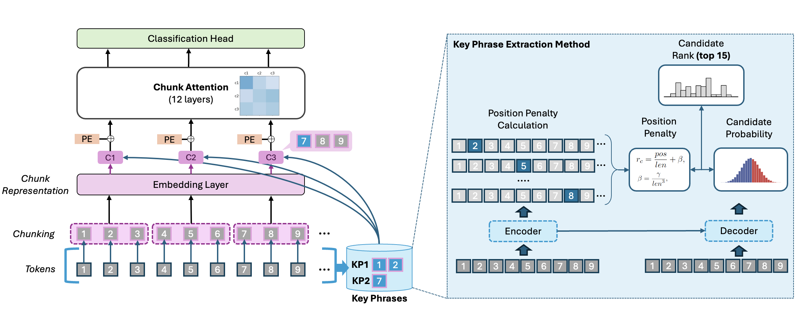

# ChuLo: Chunk-Level Key Information Representation for Long Document Understanding

<div align="center">
      <h2>Authors</h2>
      <p>
        <strong>Yan Li</strong><sup>1</sup>,  
        <strong>Soyeon Caren Han</strong><sup>2</sup>,  
        <strong>Yue Dai</strong><sup>3</sup>,  
        <strong>Feiqi Cao</strong><sup>1</sup>
        <br>
        <em>* Corresponding Author</em>
      </p>
</div>

<div align="center">
    <p>
        <sup>1</sup> The University of Sydney 
        <sup>2</sup> The University of Melbourne
        <sup>3</sup> The University of Western Australia
    </p>
</div>

<div align="center">
<p>
      <sup>1</sup> <a href="mailto:yali3816@uni.sydney.edu.au">yali3816@uni.sydney.edu.au</a> 
      <a href="mailto:fcao0492@uni.sydney.edu.au">fcao0492@uni.sydney.edu.au</a> 
      <sup>2</sup> <a href="mailto:caren.han@unimelb.edu.au">caren.han@unimelb.edu.au</a>,  
      <sup>3</sup> <a href="mailto:yue.dai@research.uwa.edu.au">yue.dai@research.uwa.edu.au</a>
</p>
</div>

<div align="center">

<strong style="font-size: 18px;">Accepted by the 2025 Annual Meeting</strong> <br>
    <strong style="font-size: 18px;">of the Association for Computational Linguistics</strong> <br>
    <strong style="font-size: 18px;">(ACL 2025)</strong>
</div>


Implementation of ChuLo method in [ChuLo: Chunk-Level Key Information Representation for Long Document Understanding](https://arxiv.org/abs/2410.11119). 


## Updates
- [29/05/2025]:🎉 Open source!


## Requirements:
- Please use the versions of the libraries written in the pip_requirements.txt.


## 1. Overview 
Transformer-based models have achieved remarkable success in various Natural Language Processing (NLP) tasks, yet their ability to handle long documents is constrained by computational limitations. Traditional approaches, such as truncating inputs, sparse self-attention, and chunking, attempt to mitigate these issues, but they often lead to information loss and hinder the model's ability to capture long-range dependencies. In this paper, we introduce ChuLo, a novel chunk representation method for long document understanding that addresses these limitations. Our ChuLo groups input tokens using unsupervised keyphrase extraction, emphasizing semantically important keyphrase based chunks to retain core document content while reducing input length. This approach minimizes information loss and improves the efficiency of Transformer-based models. Preserving all tokens in long document understanding, especially token classification tasks, is important to ensure that fine-grained annotations, which depend on the entire sequence context, are not lost. We evaluate our method on multiple long document classification tasks and long document token classification tasks, demonstrating its effectiveness through comprehensive qualitative and quantitative analysis.

<p align="center">



## 2. How to Use ChuLo

### 2.1 Setup

- Install the required libraries listed in pip_requirements.txt.

- Download the source code.

### 2.2 Extact the keyphrases

We provide code to extract keyphrases from the datasets. We provide two methods to extract keyphrases, one is using YAKE, and the other is using PromptRank. Users can use the following example command to extract keyphrases from the datasets:

```
python key_phrase_split_analysis.py --config ./config/eurlex_key_phrase_split2_all_locs.toml --whole_doc --not_split
```
The "key_phrase_split2" in attn_mode means using YAKE to extract keyphrases, while "key_phrase_split" means using PromptRank to extract keyphrases. The "whole_doc" means that we will extract keyphrases from the whole document, while "not_split" means that we will not split the datasets.
All the extracted files will be saved to results/cache/key_phrase_split/.

### 2.3 Run the experiments

We provide scripts for running experiments for each task. Users can useing the following example command to run the experiments for the all of the tasks:

```
python run_pl_ex.py --config ./config/eurlex_key_phrase_chunk_rep_bert.toml
```

Note we also provided all the configs for keyphrase exgtraction and experiments in the config folder. Users can modify the configs to run the experiments for different tasks or different keyphrase extraction methods.


------


If you find our method useful, please kindly cite our paper.
```bibtex
@misc{li2024chulochunklevelkeyinformation,
      title={ChuLo: Chunk-Level Key Information Representation for Long Document Processing}, 
      author={Yan Li and Soyeon Caren Han and Yue Dai and Feiqi Cao},
      year={2024},
      eprint={2410.11119},
      archivePrefix={arXiv},
      primaryClass={cs.CL},
      note={Accept to ACL 2025}, 
}
```

## 4. Contributing
We welcome contributions from the research community to improve the effeicency of ChuLo. If you have any idea or would like to report a bug, please open an issue or submit a pull request.

## 5. License
The code is released under the MIT License.

